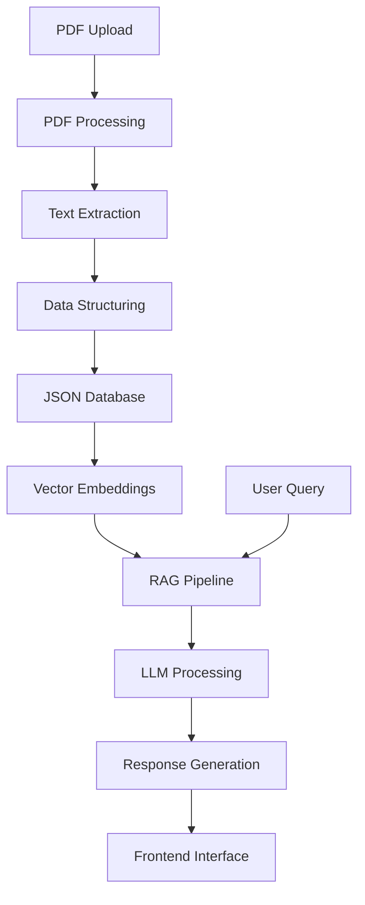

# DASA Genera AI Assistant - Sprint 1

## 📋 Problema

Os relatórios genéticos do Genera são entregues em formato PDF com linguagem técnica e alto volume de dados, dificultando a compreensão por pacientes sem formação médica. Isso limita a tomada de decisão informada sobre saúde e prevenção.

## 🎯 Solução

Sistema baseado em IA que transforma PDFs técnicos em dados estruturados, permitindo:
- Interpretação automatizada dos resultados
- Respostas a perguntas em linguagem natural
- Recomendações personalizadas baseadas no perfil genético
- Visualização interativa dos dados

## 👥 Usuários

1. **Pacientes/Clientes**: Buscam entender seus resultados genéticos sem conhecimento técnico
2. **Médicos/Geneticistas**: Precisam de resumos rápidos e insights para orientação clínica
3. **Laboratórios**: Desejam melhorar a experiência do cliente e reduzir dúvidas pós-exame

## 📊 Dados - Estruturação

### Exemplo de JSON estruturado:

```json
{
  "patient_id": "PAT-2024-001",
  "report_date": "2024-10-15",
  "sections": {
    "personal_info": {
      "name": "João Silva",
      "age": 42,
      "gender": "Masculino"
    },
    "genetic_risks": [
      {
        "condition": "Diabetes Tipo 2",
        "risk_level": "Moderado",
        "confidence": 0.87,
        "genes": ["TCF7L2", "PPARG"],
        "recommendations": ["Monitorar glicemia", "Exercícios regulares"]
      }
    ],
    "ancestry": {
      "european": 65,
      "african": 20,
      "native_american": 15
    },
    "carrier_status": [
      {
        "condition": "Fibrose Cística",
        "status": "Portador",
        "gene": "CFTR",
        "implications": "Risco em descendentes"
      }
    ]
  }
}
```

## 🏗️ Arquitetura



### Componentes Principais:

1. **PDF Processing Pipeline**
   - Upload de arquivos PDF
   - Extração de texto com PyPDF2/PDFPlumber
   - OCR para PDFs escaneados (Tesseract)

2. **NLP & Data Structuring**
   - Limpeza e tokenização
   - Identificação de seções e entidades
   - Conversão para JSON estruturado

3. **AI & LLM Integration**
   - Modelos: GPT-4, Claude ou Llama 3 (via API)
   - RAG (Retrieval-Augmented Generation) com embeddings
   - Sistema de prompts para interpretação genética

4. **Frontend Interface**
   - Dashboard com visualizações
   - Chatbot para perguntas
   - Visualização de riscos e recomendações

## 🤖 IA - Estratégia

### Abordagem RAG (Retrieval-Augmented Generation):
1. **Embedding**: Conversão do conteúdo estruturado em vetores
2. **Retrieval**: Busca de informações relevantes para cada pergunta
3. **Generation**: Resposta contextualizada pelo LLM

### Tipos de Interação:
1. **Pergunta/Resposta**: "Qual meu risco para doenças cardíacas?"
2. **Explicação**: "Me explique o que significa ser portador do gene BRCA1"
3. **Recomendação**: "Quais exames preventivos devo fazer?"

## 🚀 Próximos Passos (Sprint 2)

1. **Desenvolvimento do MVP**
   - Pipeline completo de processamento de PDF
   - API básica para extração e estruturação
   - Interface web simples

2. **Integração IA**
   - Implementação do RAG pipeline
   - Testes com dados simulados
   - Avaliação de modelos LLM

3. **Validação**
   - Testes com usuários reais
   - Ajustes na interface
   - Otimização de performance

## 🔒 Governança de Dados

### Privacidade e Segurança:
- **Anonimização**: Remoção de dados pessoais identificáveis
- **Criptografia**: Dados em repouso e em trânsito
- **Consentimento**: Controle explícito do usuário sobre compartilhamento

### Guard Rails:
- **Restrições de Uso**: Proibição de diagnósticos médicos
- **Validação Médica**: Todas as recomendações com aviso de consulta profissional
- **Auditoria**: Logs de todas as interações para rastreabilidade

## 📁 Estrutura do Projeto

```
.
├── data/
│   ├── raw/           # PDFs originais
│   └── processed/     # JSONs estruturados
├── src/
│   ├── pdf_processing/# Extração de PDF
│   ├── nlp/          # Processamento linguagem natural
│   ├── api/          # API backend
│   └── frontend/     # Interface web
├── architecture/     # Diagramas e documentação
├── examples/        # Exemplos de dados
└── docs/           # Documentação técnica
```

## 🎥 Apresentação em Vídeo

[Link para vídeo explicativo - a ser adicionado]

---

**Time:** [Nomes dos integrantes]  
**Turma:** [FIAP - 2026]  
**Tutor:** CaiqueFiap-2026