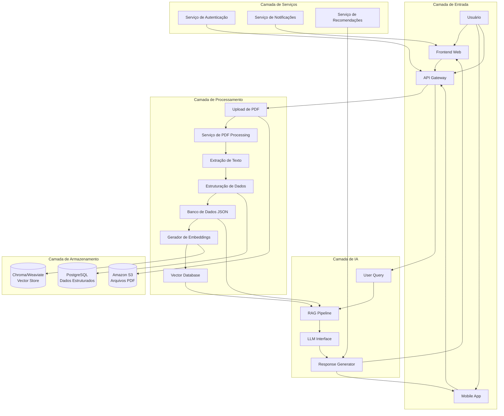
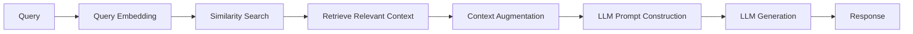

# Arquitetura do Sistema - DASA Genera AI Assistant

## Visão Geral da Arquitetura



## Componentes Detalhados

### 1. **Frontend Web (React/Next.js)**
- Dashboard interativo para visualização de resultados
- Interface de chat para perguntas em tempo real
- Upload de arquivos PDF com progresso visual
- Gráficos e visualizações de dados genéticos
- Sistema responsivo para mobile/desktop

### 2. **Mobile App (React Native)**
- Funcionalidades principais do web app
- Notificações push para novas pesquisas
- Acesso offline a resultados anteriores
- Integração com health kit (iOS/Android)

### 3. **API Gateway (FastAPI/Node.js)**
- Roteamento de todas as requisições
- Autenticação e autorização
- Rate limiting e segurança
- Logging e monitoramento

### 4. **Serviço de PDF Processing**
**Tecnologias:** PyPDF2, PDFPlumber, Tesseract OCR
- Extração de texto de PDFs estruturados
- OCR para PDFs escaneados
- Identificação de seções e tabelas
- Limpeza e normalização de texto

### 5. **Serviço de Estruturação de Dados**
**Tecnologias:** spaCy, NLTK, RegEx
- Análise sintática do texto extraído
- Identificação de entidades (doenças, genes, riscos)
- Mapeamento para schema JSON pré-definido
- Validação de dados estruturados

### 6. **Banco de Dados PostgreSQL**
**Schema principal:**
- `patients`: Informações demográficas
- `reports`: Relatórios estruturados em JSONB
- `queries`: Histórico de perguntas e respostas
- `recommendations`: Recomendações geradas
- `audit_logs`: Logs de acesso e processamento

### 7. **Vector Database (Chroma/Weaviate)**
- Armazenamento de embeddings dos relatórios
- Busca por similaridade semântica
- Indexação para rápida recuperação
- Atualização incremental de embeddings

### 8. **RAG Pipeline (Retrieval-Augmented Generation)**


**Componentes:**
- **Query Processor**: Processa a pergunta do usuário
- **Retriever**: Busca contexto relevante no vector store
- **Ranker**: Ordena resultados por relevância
- **Context Builder**: Constrói contexto para o LLM

### 9. **LLM Interface**
**Opções de Modelo:**
- **GPT-4**: Alta precisão, custo mais elevado
- **Claude 3**: Bom balanço custo-benefício
- **Llama 3**: Open-source, controle total
- **Mixtral**: Mistura de especialistas

**Sistema de Prompts:**
```python
SYSTEM_PROMPT = """
Você é um assistente especializado em genética médica.
Suas respostas devem ser:
1. Precisas e baseadas no contexto fornecido
2. Em linguagem acessível para pacientes
3. Sempre mencionar limitações dos dados
4. Nunca dar diagnóstico médico
5. Recomendar consulta com profissional
"""
```

### 10. **Serviço de Recomendações**
- Análise de perfil genético para sugestões personalizadas
- Integração com guidelines médicas atualizadas
- Personalização baseada em idade, gênero, estilo de vida
- Atualização automática com novas pesquisas

### 11. **Serviço de Notificações**
- Alertas sobre novas pesquisas relevantes
- Lembretes de exames preventivos
- Atualizações de interpretação genética
- Notificações via email/push

### 12. **Serviço de Autenticação**
- Autenticação OAuth2 (Google, Facebook, Apple)
- RBAC (Role-Based Access Control)
- MFA (Multi-Factor Authentication)
- Gerenciamento de sessões

## Fluxo de Dados Completo

### 1. Upload e Processamento Inicial
```
Usuário → Upload PDF → API Gateway → PDF Processing → 
Text Extraction → Data Structuring → PostgreSQL + Vector DB
```

### 2. Interação com Chat
```
Usuário → Pergunta → API Gateway → RAG Pipeline → 
Vector Search → Context Retrieval → LLM → Resposta → Usuário
```

### 3. Geração de Recomendações
```
Perfil Genético → Recommendation Service → 
Medical Guidelines → Personalized Suggestions → Usuário
```

## Escalabilidade e Performance

### Estratégias de Escalabilidade:
1. **Horizontal Scaling**: Microserviços independentes
2. **Caching**: Redis para queries frequentes
3. **CDN**: Para arquivos estáticos e PDFs
4. **Load Balancer**: Distribuição de carga entre instâncias

### Métricas de Performance:
- **PDF Processing**: < 30 segundos para PDF de 50 páginas
- **Query Response**: < 3 segundos para 95% das perguntas
- **Uptime**: 99.9% disponibilidade
- **Concorrência**: Suporte a 1000 usuários simultâneos

## Segurança e Conformidade

### Medidas de Segurança:
1. **Criptografia**: AES-256 para dados em repouso, TLS 1.3 para trânsito
2. **Anonimização**: Remoção de dados pessoais antes do processamento
3. **Auditoria**: Logs completos de todas as operações
4. **Backup**: Backup diário com retenção de 30 dias

### Conformidade:
- **LGPD**: Conformidade completa com lei brasileira
- **HIPAA**: Para dados de saúde (se aplicável)
- **GDPR**: Para usuários europeus
- **ANVISA**: Para recomendações médicas

## Monitoramento e Observabilidade

### Ferramentas:
- **Prometheus + Grafana**: Métricas de performance
- **ELK Stack**: Logs centralizados
- **Jaeger**: Distributed tracing
- **Sentry**: Error tracking

### Alertas:
- Latência acima de 5 segundos
- Erros acima de 1%
- Uso de CPU acima de 80%
- Espaço em disco abaixo de 20%

## Custos Estimados

### Infraestrutura (Mensal):
- **AWS/GCP**: $500-1000 (dependendo do tráfego)
- **LLM API**: $200-500 (baseado em uso)
- **Storage**: $50-100 (PDFs + vetores)
- **Monitoring**: $100-200

### Otimização de Custos:
- Cache agressivo de respostas frequentes
- Batch processing de PDFs durante horário comercial
- Tiered storage (S3 Glacier para PDFs antigos)
- Modelos menores para queries simples